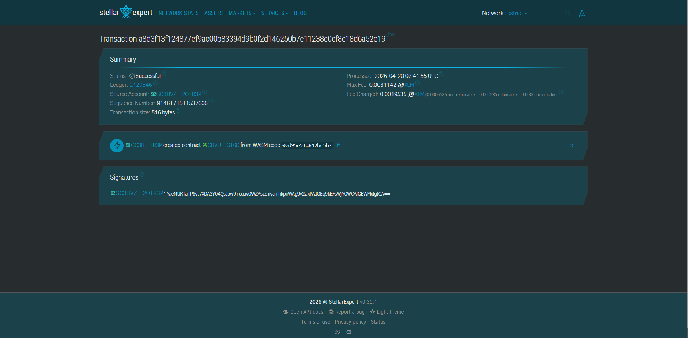
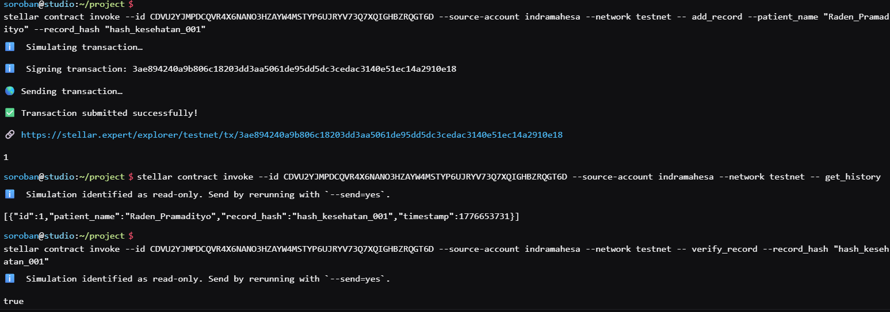

# MedVerify: Blockchain-Based Medical Record Indexer

**MedVerify** - Decentralized Security for Patient Data Sovereignty.

## Project Description

MedVerify is a decentralized smart contract solution built on the Stellar blockchain using the Soroban SDK. This project provides a secure and permanent platform for managing medical record indexes without relying on centralized database providers.

The system enables healthcare providers to record, view, and verify the integrity of medical documents through cryptographic hashes. Every piece of data is stored within the contract's instance storage, ensuring data persistence and immutable audit transparency.

## Project Vision

Our vision is to revolutionize health data sovereignty by:

* **Decentralizing Health Data**: Moving medical record indexes from centralized servers to a global, distributed blockchain network.
* **Ensuring Data Integrity**: Guaranteeing that every medical record has a unique digital fingerprint that cannot be tampered with.
* **Enhancing Patient Sovereignty**: Empowering patients and doctors with transparent data access directly on the blockchain.

## Key Features

### 1. Medical Record Indexing
* Register patient data with a single function call.
* Store document hashes for maximum security.
* Automatic timestamping for every entry via the blockchain ledger.

### 2. Audit History Retrieval
* Retrieve the entire medical record history in a single structured call.
* Data is presented in a format that is easily integrated with frontend applications.

### 3. Instant On-Chain Verification
* Verify whether a medical document is authentic and registered on the network.
* Instant verification process without the need for third-party intermediaries.

## Contract Details

* **Contract ID**: `CDVU2YJMPDCQVR4X6NANO3HZAYW4MSTYP6UJRYV73Q7XQIGHBZRQGT6D`
  
  
* **Network**: Stellar Testnet

## Support for SDG (Sustainable Development Goals)

This project directly supports **SDG Goal 3: Good Health and Well-being**.

By providing a secure infrastructure for medical data, MedVerify contributes to:
1. **Target 3.8**: Achieving universal health coverage through the efficiency of secure digital data management.
2. **Resilient Health Systems**: Reducing health data fragmentation between institutions through blockchain-based index standardization, accelerating patient handling in emergencies.

---

## Technical Requirements

* Soroban SDK
* Rust Programming Language
* Stellar Blockchain Network

## Getting Started

Interact with the contract through three main functions:

* `add_record` - Add a new medical record (Patient Name & Hash).
* `get_history` - Retrieve the complete history from the contract.
* `verify_record` - Validate if a document hash is already registered.
